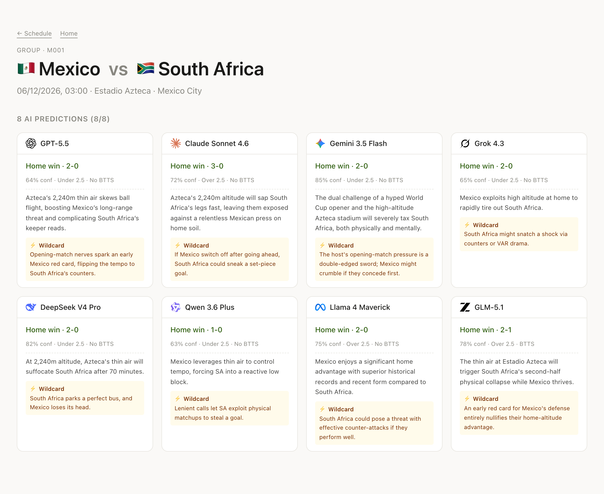

# 🏆 AI World Cup Prediction Arena

**English | [中文](README_CN.md)**

> Eight top-tier AIs go **head-to-head predicting** the outcomes of the 2026 FIFA World Cup — see who calls it right and who faceplants.
>
> At its core this is an **entertainment / content media site** (built to spread on Weibo / Xiaohongshu / Zhihu / X), and the goal is reach and shareability ——
> the funnier an AI's flop, the more traffic it pulls; the post-match "called-it-wrong" posters are the core shareable assets.

The 8 AIs: **GPT-5.5** / **Claude Sonnet 4.6** / **Gemini 3.5 Flash** / **Grok 4.3** / **DeepSeek V4 Pro** /
**Qwen 3.6 Plus** / **Llama 4 Maverick** / **GLM-5.1**, all wired in through a single [OpenRouter](https://openrouter.ai) API key.

---

## Screenshots

**Match detail** — all 8 AIs' predictions for one match side by side (scoreline / over-under / both-teams-to-score / confidence / "flop risk"):



> Each AI is shown with its [official brand logo](https://github.com/lobehub/lobe-icons) (descriptive reference, not a commercial endorsement).

---

## Tech stack

| Layer | Choice |
|---|---|
| Frontend / Backend | Next.js 16 (App Router · Turbopack · standalone build) + React 19 + Tailwind 4 |
| i18n | `next-intl` (zh / en), path prefixes `/zh/...` `/en/...` |
| Database | PostgreSQL 16 |
| ORM | Prisma 7 + `@prisma/adapter-pg` (**no binary engine**, painless across architectures) |
| AI calls | OpenRouter (OpenAI-compatible format, one key for all 8) |
| Score data source | [`openfootball/worldcup.json`](https://github.com/openfootball/worldcup.json) (public domain, no API key) |
| Deployment | **`docker compose`** — self-contained, runs on any Docker host |

---

## Quick start (recommended: full stack via Docker Compose)

**Prerequisite**: Docker Desktop running.

```bash
# 1. Copy and fill in the environment variables
cp .env.example .env.local
# Edit .env.local — at minimum set:
#   OPENROUTER_API_KEY=sk-or-v1-...        ← create one at https://openrouter.ai/keys
#   CRON_SECRET=<any string; for prod use openssl rand -hex 32>

# 2. Start db + web + cron (long-running)
docker compose up -d

# 3. First time: seed data (import 48 teams + 104 matches)
docker compose --profile setup up tools

# 4. Open in browser
open http://localhost:3000

# 5. Check the full stack
docker compose ps
docker compose logs -f cron        # watch the cron sidecar hit the endpoints every 15 min
```

Ready to use the moment it's up — three long-running services: **db** (Postgres) + **web** (Next.js standalone) + **cron** (alpine + curl with a built-in scheduler).

### Container services overview

| Service | Image | Role |
|---|---|---|
| `db` | `postgres:16` | Postgres 16; on first boot auto-runs `schema_v1.sql` (9 tables + 4 views + INSERT for the 8 AIs) |
| `web` | `ai-wcp-web` (built locally, ~285MB) | Next.js standalone, port 3000 |
| `cron` | `alpine:3` | Built-in scheduler, hits `/api/cron/predict-l1` + `/api/cron/fetch-results` every 15 min |
| `tools` | `ai-wcp-tools` (built locally, ~560MB) | **On-demand** (`--profile setup`), contains full source + `tsx`, runs ops scripts |

### Common commands

```bash
# === Start / stop ===
docker compose up -d                                 # start db + web + cron
docker compose down                                  # stop containers, keep data volume
docker compose down -v                               # wipe everything (tables rebuilt next time)
docker compose ps                                    # show status
docker compose logs -f web                           # tail web logs
docker compose logs -f cron                          # tail cron logs (watch the AI calls)

# === Rebuild (after editing source / Dockerfile) ===
docker compose build web tools
docker compose up -d --build                         # one-shot

# === One-off ops tasks ===
docker compose --profile setup up tools              # default: import the schedule
docker compose --profile setup run --rm tools npx tsx scripts/verify_db.ts
docker compose --profile setup run --rm tools npx tsx scripts/predict_day.ts 2026-06-11
docker compose --profile setup run --rm tools npx tsx scripts/fetch_results.ts
docker compose --profile setup run --rm tools npx tsx scripts/fetch_results.ts 2022  # run a historical year

# === Direct DB access (debugging) ===
docker compose exec db psql -U postgres -d ai_fifa
docker compose exec db psql -U postgres -d ai_fifa -c "SELECT * FROM v_leaderboard;"
```

---

## Dev mode (run Next.js on the host, only db in a container)

Faster HMR / debugging. **Prerequisite**: Node 24+ installed.

```bash
# 1. Install deps (triggers prisma generate)
npm install

# 2. Copy .env.local (same as above)
cp .env.example .env.local
# edit and fill in values

# 3. Start only db (port 5432 exposed to host)
docker compose up -d db

# 4. First-time seed (run from host)
npm run import:schedule
npm run verify:db

# 5. Start the Next dev server (HMR)
npm run dev
# visit http://localhost:3000
```

**Note**: full-stack Docker mode and dev mode **can't run at the same time** (both want port 3000).

### npm scripts available on the host

| Command | Purpose |
|---|---|
| `npm run dev` | Next dev server (port 3000, HMR) |
| `npm run build` | Production build (`output: 'standalone'`) |
| `npm start` | Run the production build artifact |
| `npm run typecheck` | `tsc --noEmit` type-only check |
| `npm run lint` | ESLint |
| `npm run db:studio` | Prisma Studio (browse tables at http://localhost:5555) |
| `npm run db:pull` | Reverse-sync `prisma/schema.prisma` from the DB (use after editing `schema_v1.sql`) |
| `npm run import:schedule` | Import 48 teams + 104 matches |
| `npm run verify:db` | Database readiness checks |
| `npm run predict:day -- 2026-06-11` | Trigger L1 predictions for all matches on a given ET date (really burns OpenRouter) |
| `npm run fetch:results` | Pull finished-match data from openfootball 2026 |

---

## Project structure

```
ai-fifa/
├── docker-compose.yml          # 4 services: db / web / cron / tools
├── Dockerfile                  # 4 stages: deps → build → runtime → tools
├── .dockerignore
├── .env.example                # copy to .env.local then fill in
├── schema_v1.sql               # DB source of truth: 9 tables + 4 views + 8-AI INSERTs
├── wc2026_schedule.json        # 104-match schedule + 12 groups × 4 teams
├── poc_experiment_v5.html      # proof of concept (source of the prompt template / normalizeData)
│
├── prisma/
│   └── schema.prisma           # Prisma models (snake_case field names matching the DB)
├── prisma.config.ts            # Prisma 7+ config (for the CLI)
├── next.config.ts              # Next + next-intl + standalone
│
├── messages/                   # i18n translation dictionaries
│   ├── zh.json
│   └── en.json
│
├── src/
│   ├── middleware.ts           # next-intl locale detection
│   ├── i18n/
│   │   ├── routing.ts          # locales: ['zh', 'en'], defaultLocale: 'zh'
│   │   ├── request.ts
│   │   └── navigation.ts       # type-safe Link / useRouter, auto locale prefix
│   ├── components/
│   │   ├── LocaleSwitcher.tsx   # native select dropdown (中文 / English, easy to extend)
│   │   └── LocalDateTime.tsx    # SSR fallback + browser-local timezone toLocaleString
│   ├── lib/
│   │   ├── prisma.ts           # PrismaClient singleton (lazy + PrismaPg adapter)
│   │   ├── ai-models.ts        # the 8 model constants (id / openrouter ID / brand color)
│   │   ├── team-mapping.ts     # 48 teams English → Chinese + FIFA 3-letter code + flag emoji
│   │   ├── team-name.ts        # locale-aware team-name resolution
│   │   ├── types.ts            # Outcome / OverUnder / NormalizedPrediction
│   │   ├── openrouter.ts       # callWithRetry + parseJsonContent + normalizeData (ported from POC)
│   │   ├── prompts.ts          # SYSTEM_PROMPT + buildUserPrompt (identical for all 8)
│   │   ├── concurrency.ts      # withConcurrency promise pool
│   │   ├── predict-l1.ts       # L1 core pipeline (shared by cron endpoint + CLI script)
│   │   ├── openfootball.ts     # fetch + team-name normalization + score derivation
│   │   ├── results-sync.ts     # match_results upsert + triggers scoring + KO fill
│   │   ├── scoring.ts          # scoring algorithm (+3/+5/+1/+1, perfect bonus, upset ×1.5)
│   │   ├── ko-fill.ts          # R32 auto-fill (Winner/Runner-up only; Best 3rd is a TODO)
│   │   └── api-logs.ts         # write api_call_logs
│   └── app/
│       ├── globals.css         # Tailwind 4 @theme + the 8 AI brand-color variables
│       ├── [locale]/           # i18n routing
│       │   ├── layout.tsx      # html + NextIntlClientProvider + global LocaleSwitcher
│       │   ├── page.tsx        # home: next 6 upcoming matches + AI leaderboard Top 3
│       │   ├── bracket/        # full schedule (12 groups + 6 knockout stages)
│       │   ├── leaderboard/    # AI leaderboard
│       │   └── match/[id]/     # match detail (8 prediction cards, bilingual reason/wildcard)
│       └── api/cron/
│           ├── predict-l1/     # batch-predict all of a day's matches 6h before kickoff
│           └── fetch-results/  # pull openfootball, upsert match_results, trigger scoring + ko_fill
│
└── scripts/                    # CLI ops tasks (run from host or the tools container)
    ├── import_schedule.ts      # JSON → teams + matches tables
    ├── verify_db.ts            # 7 database-readiness checks
    ├── predict_day.ts          # trigger L1 predictions for a given date
    └── fetch_results.ts        # one-off score sync
```

---

## Three-tier prediction timeline (brief design)

| Tier | Trigger | Write rule | Status |
|---|---|---|---|
| **L1 single match** | 6h before kickoff, batched **by ET date** across all that day's matches | `UNIQUE (match_id, model_id)` physically guarantees it's never modified | ✅ |
| **L2 group qualification** | after each group-stage match finishes | uses a `version` field to keep historical snapshots, no UPDATE | TODO |
| **L3 tournament-level** (champion / final 4) | once after all group games end + once after the semifinals | same as L2, rolling version | TODO |

---

## Database design

9 tables + 3 views. Table names are all snake_case; primary keys below.

**Tables**: `ai_models` · `teams` · `matches` · `predictions_l1` · `predictions_l2` · `predictions_l3` · `match_results` · `prediction_scores` · `api_call_logs`

**Views**:
- `v_leaderboard` — live AI leaderboard (SELECT straight into `/leaderboard`)
- `v_upcoming_matches` — **the home page's main query**: all matches with `kickoff_at > now() AND status <> 'finished'`, carrying `prediction_count` / `avg_confidence` / `is_disputed` / bilingual team names
- `v_today_matches` — "today window" (`now-6h ~ now+24h`), for the hot stretch mid-to-late tournament
- `v_model_reliability` — 7-day API success rate (<90% trips the alert threshold)

**ID conventions** (all `text` primary keys, not UUIDs):
- `ai_models.id`: short slug `'gpt'` / `'claude'` / `'gemini'` / `'grok'` / `'deepseek'` / `'qwen'` / `'llama'` / `'glm'`
- `teams.id`: FIFA 3-letter code `'ARG'` / `'BRA'` / `'CHN'`
- `matches.id`: `'M001'`–`'M104'` (aligned with schedule.json)
- prediction tables / `prediction_scores`: UUID

**Scoring rules** (implemented in `src/lib/scoring.ts`):
- `outcome_correct` +3 / `score_exact` +5 (stacks) / `goals_correct` +1 / `btts_correct` +1
- all four correct → `is_perfect`, extra +3 → 13 total
- calling an upset (≥3 other models predicted a different outcome) → `is_upset_hit`, score **×1.5**
- all four wrong → `is_total_miss` — prime "called-it-wrong" content material

---

## API endpoints

| Endpoint | Method | Auth | Purpose |
|---|---|---|---|
| `/api/cron/predict-l1` | GET | `Authorization: Bearer $CRON_SECRET` | trigger L1 predictions (batched by ET date) |
| `/api/cron/fetch-results` | GET | same | pull openfootball 2026 finished matches + trigger scoring + auto-fill R32 |

**Dev-only extensions** (`NODE_ENV !== 'production'`):
- `/api/cron/predict-l1?date=2026-06-11` — override the default "auto-decide from the next match"
- `/api/cron/predict-l1?match_ids=M001,M002` — specify matches explicitly

---

## Vendor lock-in boundaries

| Component | Lock-in status | How to swap |
|---|---|---|
| **Postgres** | zero lock-in | change `DATABASE_URL` to point at Neon / Supabase / RDS / DO / self-hosted |
| **`pg` driver** | standard Postgres protocol | swap the adapter to change drivers |
| **Prisma** | a library dependency, not a cloud service | the query API can be rewritten as raw SQL to drop back to plain `pg`/`postgres` |
| **Next.js** | deploys on any Node host | Docker compose already self-contains it |
| **Cron** | self-contained sidecar (alpine + curl) | or let Vercel Cron / GitHub Actions / your own cron hit the endpoints |
| **OpenRouter** | deliberate lock-in (brief decision: one key for all 8) | — |

---

## Not done yet (honest list)

- **L2 / L3 predictions** — group qualification + champion predictions, need their own prompt + cron (the framework is wired, the business logic is missing)
- **R16 → final auto-fill** — `pending_label` only exists at R32; the FIFA-bracket derivation for later stages isn't written
- **Auto-fill for the 8 R32 slots involving Best 3rd** — FIFA uses a fixed permutation lookup table to assign the 8 advancing 3rd-place teams to 8 R32 slots; left as a TODO
- **"Called-it-wrong" poster templates** — visual direction TBD (brief priority: medium)
- **Unit-test framework** — not introduced

### Recently shipped iterations

- **Bilingual prompt (v1.1)** — the AI emits `reason_zh / reason_en / wildcard_zh / wildcard_en` from a single prompt, stored in 4 columns. Frontend picks by locale; v1.0 legacy data falls back to Chinese. **Not locked to one language** and doesn't break the "all 8 are treated equally" foundation.
- **Browser-local timezone** — `<LocalDateTime>` client component; every page renders dates in the user's browser TZ.
- **Home page switched to upcoming** — no longer depends on the "today 6h window"; shows the nearest 6 matches directly.
- **Global language switch** — native dropdown, easy to extend to ja / es / pt and more locales.
- **Official brand logos** — the 8 AIs' color-dot badges replaced with official [lobe-icons](https://github.com/lobehub/lobe-icons) logos (`public/ai-logos/*.svg`); home / leaderboard titles use a lucide trophy icon.
- **Model roster update** — GPT-5.5 / Gemini 3.5 Flash / GLM-5.1 (replacing the original Kimi K2.6). Swapping a model only touches `ai-models.ts` + `schema_v1.sql` + the DB `ai_models` row; keep the internal `id` and the history carries over automatically.

---

## Document map

| Document | Role |
|---|---|
| `README.md` (this file) | English user docs (the default GitHub entry point) |
| `README_CN.md` | Chinese user docs: startup / usage / project structure / current capabilities |
| `CLAUDE.md` | For the Claude Code agent: architectural invariants / implementation traps / cross-file inconsistencies |
| `AGENTS.md` | For other AI agents: important Next 16 differences |
| `/Users/david/Downloads/project_brief_v1.2.md` | **The authoritative document**: product direction / business strategy / content operations |

> 📌 **Maintenance note**: `README.md` (English) and `README_CN.md` (Chinese) are two language versions of the same document — **any update must change both**.
